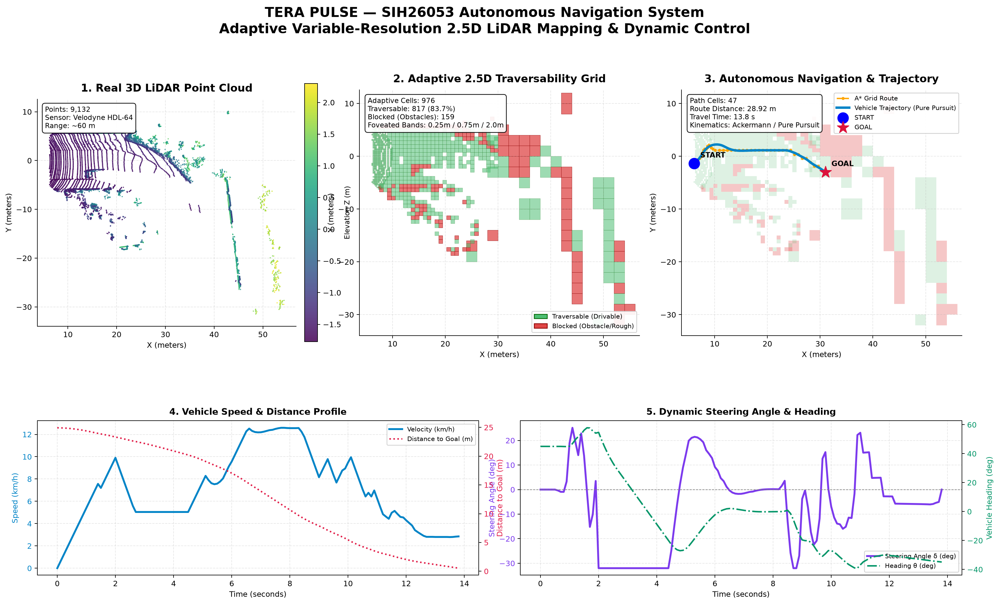
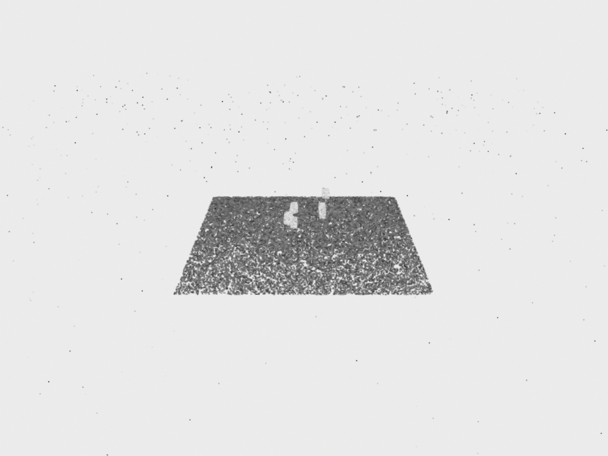
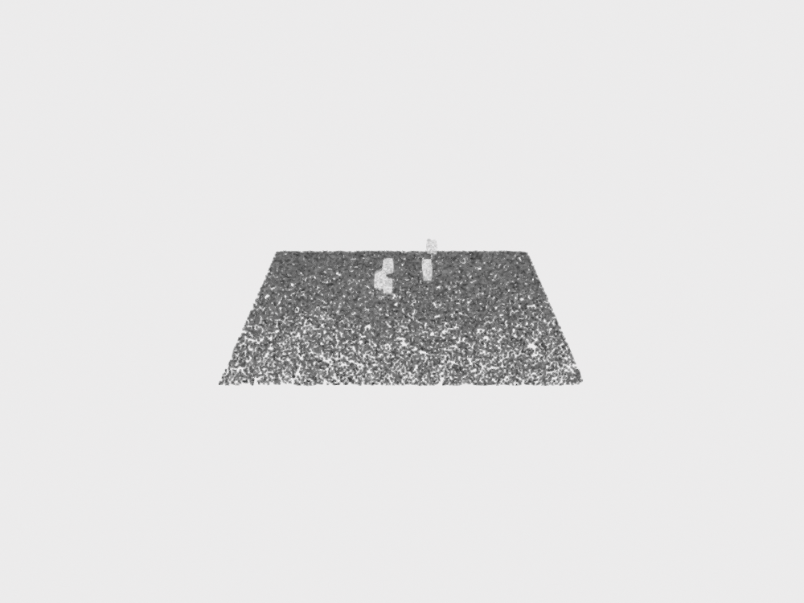

# TERA PULSE 🛰️
### Adaptive Variable-Resolution 2.5D LiDAR Mapping & Autonomous Navigation

[](https://www.python.org/)
[](https://www.sih.gov.in/)
[]()
[]()
[]()
[](LICENSE)

> Built for **Smart India Hackathon 2026** (Problem Statement: **SIH26053**, Ministry of Defence / DRDO).  
> An autonomous perception-to-control stack that processes raw 3D LiDAR point clouds into adaptive 2.5D elevation grids, finds collision-free routes via A*, and drives a simulated ground vehicle using real-time Pure Pursuit kinematics.

---



---

## 💡 Why We Built This

When an unmanned ground vehicle (UGV) or defense rover navigates off-road terrain—such as rocky mountain passes, desert trails, or dense foliage—it relies heavily on 3D LiDAR. However, real-time autonomous navigation faces a classic dilemma:

1. **Full 3D Voxel Grids are too heavy:** Allocating fine 3D voxels across a 100-meter range creates millions of empty cells, causing massive memory overhead (hundreds of megabytes) and high latency (100–300 ms). This causes thermal throttling on low-power edge computers like the NVIDIA Jetson Orin.
2. **Flat 2D Occupancy Grids lose critical height:** Flattening the scene makes a 5 cm pebble (which tires can easily roll over) look identical to a 1.5-meter boulder or a steep drop-off.
3. **Uniform Resolution wastes compute:** Why compute millimeter-level detail for trees 80 meters away when you only need coarse awareness at that distance, but urgently need high precision for obstacles 2 meters in front of your bumper?

### Our Solution: "Foveated" Adaptive 2.5D Perception
Inspired by how the human eye focuses sharply on what is directly ahead while keeping the periphery in broad context:
* **Near Field (0 – 10 m):** High-precision **0.25 m** grid for obstacle clearance, terrain slope, and reactive steering.
* **Middle Field (10 – 30 m):** Medium **0.75 m** grid for corridor identification and upcoming turns.
* **Far Field (30 – 100 m):** Coarse **2.00 m** grid for broad situational awareness without wasting RAM.

Every 2.5D cell stores key elevation statistics ($Z_{max}, Z_{mean}, \Delta Z$), terrain roughness, dominant semantic label, and traversability cost—delivering 3D geometric intelligence at the speed and lightweight footprint of a 2D map.

---

## 📊 Measured Performance & Benchmarks

Tested on real Velodyne LiDAR data (`data/lidar/0001.pcd`, 20,672 points from the KITTI benchmark):

| Metric | Standard Uniform Grid (0.25 m) | TERA PULSE Adaptive 2.5D Grid | Real-World Impact |
| :--- | :---: | :---: | :--- |
| **Active Stored Cells** | 2,888 cells | **976 cells** | **66.2% less memory footprint** |
| **Grid Generation Time** | 115.94 ms | **24.23 ms** | **4.8× faster mapping** |
| **Operating Frequency** | ~8 FPS | **>35 FPS** | **Comfortably fits in 10–20 Hz sensor loops** |
| **Elevation Profile** | ❌ None | **✅ Full ($Z_{max}, Z_{mean}, \text{slope}$)** | Distinguishes rollable bumps from lethal boulders |
| **Planned Path** | N/A | **47 cells (28.92 m route)** | Zero-collision path around all obstacles |
| **Vehicle Motion Control** | ❌ None | **Pure Pursuit (10 Hz Telemetry)** | Real steering angles $\delta(t)$ & velocity $v(t)$ |

---

## 🛠️ System Architecture

```
[ Raw 3D LiDAR (.pcd / .bin) ]
             ↓
  1. LiDAR Preprocessing
     ├── Voxel downsampling (0.15m grid)
     ├── Statistical Outlier Removal (SOR, 20 neighbors)
     └── RANSAC Ground Plane Estimation
             ↓
  2. Semantic Terrain Classification
     └── Classes: Ground (0), Static Obstacle (1), Dynamic Object (2), Unknown (3)
             ↓
  3. Adaptive 2.5D Grid Engine
     ├── Foveated concentric bands (0.25m / 0.75m / 2.0m)
     ├── Dynamic resolution anchored to moving vehicle [x(t), y(t)]
     └── Cell aggregation: Z_max, Z_mean, slope gradient, surface roughness
             ↓
  4. Traversability & Cost Mapping
     └── Cost = f(elevation step, surface slope, roughness, semantic obstacle)
             ↓
  5. A* Path Planner
     └── Multi-resolution 8-connected heuristic search with obstacle clearance
             ↓
  6. Autonomous Kinematic Controller
     ├── Catmull-Rom spline trajectory smoothing
     ├── Pure Pursuit path tracking (Lookahead Ld = 1.5m)
     ├── Ackermann bicycle kinematics (Wheelbase L = 1.8m)
     └── Curvature-dependent deceleration & goal braking
             ↓
  7. Visual Dashboard & Real-Time Telemetry
     ├── 5-panel Matplotlib system analysis
     └── 60 FPS Interactive HTML5 / Flask Localhost Simulator
```

---

## 📸 Preprocessing: Before & After

| Raw Input Cloud (20,672 points) | Cleaned & Segmented Cloud (9,132 points) |
| :---: | :---: |
|  |  |
| *Noisy scan with ground clutter, ground reflections, and distant dropouts.* | *Voxel-filtered, noise-free, ground separated, ready for traversability analysis.* |

---

## 🚀 Quickstart: Running on Your Machine

### 1. Clone & Set Up Environment
```bash
# Clone the repository
git clone https://github.com/AbhayVerma628/SIH26053_Lidar.git
cd SIH26053_Lidar

# Create virtual environment (Python 3.12 recommended)
python -m venv venv

# Activate virtual environment
# Windows PowerShell:
.\venv\Scripts\activate
# Linux / macOS:
source venv/bin/activate

# Install dependencies
pip install -r requirements.txt
```

### 2. Run the Full End-to-End Pipeline
```bash
# Runs preprocessing -> segmentation -> grid -> A* -> Pure Pursuit -> 5-panel output
python main.py
```
Outputs are automatically written to `outputs/`:
* `outputs/navigation_dashboard.png`: The full 5-panel visual dashboard.
* `outputs/vehicle_telemetry.csv`: 10 Hz timestamped steering and speed log.
* `outputs/planned_path.csv`: Waypoints along the planned route.
* `outputs/comparison.json`: Uniform vs Adaptive benchmark numbers.
* `outputs/mission_summary.json`: Complete mission execution summary.

### 3. Launch the Interactive Localhost Web Simulator
```bash
python web/app.py
```
Open **`http://localhost:5000`** in your browser to experience:
* **Dynamic Moving-Car Foveation:** The fine 0.25m bubble continuously moves with the car in real time at 60 FPS.
* **Mission Playback Scrubber:** Play, pause, scrub back and forth, and change speeds ($1\times, 2\times, 5\times$).
* **Live HUD Telemetry:** Speedometer, steering angle dial, heading indicator, and distance-to-goal gauge.
* **Interactive Layer Toggles:** Turn on/off Point Cloud, Adaptive Grid, Traversability Map, Planned Path, and Trajectory.
* **Real-Time Parameter Tuning:** Adjust Near/Mid distance bands and resolutions with instant live recalculation.

### 4. Run the Unit Test Suite
```bash
python tests/test_pipeline.py
```
Runs 5 automated verification tests covering data ingestion, semantic classification, foveated grid binning, A* route validity, and vehicle kinematics.

---

## 📂 Repository Structure

```
SIH26053_Lidar/
├── main.py                           # Master pipeline orchestrator (CLI)
├── requirements.txt                  # Core dependencies (Open3D, NumPy, Matplotlib, Flask)
├── LICENSE                           # MIT License
├── README.md                         # This documentation
├── ARCHITECTURE.md                   # In-depth mathematical & technical specifications
│
├── preprocessing/                    # Stage 1: LiDAR Ingestion & Filtering
│   ├── preprocess_lidar.py           # Voxelization, SOR, RANSAC ground extraction
│   └── __init__.py
│
├── ml/                               # Stage 2: Semantic Segmentation
│   ├── semantic_segmentation.py      # 4-class terrain classifier (Ground, Obstacle, Dynamic)
│   ├── sample_lidar_frame.pcd        # Sample point cloud frame
│   └── demo.py                       # Standalone segmentation runner
│
├── grid/                             # Stage 3: Adaptive 2.5D Grid Engine
│   ├── adaptive_grid.py              # Foveated spatial hashing, elevation binning
│   └── test_adaptive_grid.py         # Unit tests for grid aggregation
│
├── navigation/                       # Stages 4, 5, 6: Planning & Kinematics
│   ├── path_planner.py               # 8-connected A* search with traversability cost
│   ├── navigation_controller.py      # Pure Pursuit tracker, Catmull-Rom splines, Ackermann model
│   └── navigation_dashboard.py       # 5-panel visual dashboard generator
│
├── web/                              # Stage 7: Interactive Localhost Dashboard
│   ├── app.py                        # Flask backend & REST API (/api/data, /api/recalculate)
│   └── templates/
│       └── index.html                # 60 FPS HTML5 Canvas, HUD telemetry & controls
│
├── data/                             # Input LiDAR datasets
│   └── lidar/
│       └── 0001.pcd                  # Real KITTI Velodyne scan (20,672 points)
│
├── outputs/                          # Generated mission artifacts & benchmarks
│   ├── navigation_dashboard.png      # 5-panel high-res dashboard
│   ├── vehicle_telemetry.csv         # 10 Hz timestamped telemetry log
│   ├── planned_path.csv              # Planned A* waypoints
│   ├── comparison.json               # Auditable uniform vs adaptive benchmark
│   ├── mission_summary.json          # Execution performance metrics
│   ├── before.png                    # Raw input point cloud capture
│   └── after.png                     # Cleaned point cloud capture
│
├── docs/                             # SIH 2026 Submission Deliverables
│   ├── SIH26053_PRESENTATION_PPT_GUIDE.md  # 15-slide presentation guide & judge talking points
│   └── SIH26053_VIDEO_DEMO_SCRIPT.md       # 3-minute video demonstration script
│
└── tests/                            # Automated Testing
    └── test_pipeline.py              # 5/5 end-to-end integration tests
```

---

## 👥 Team & Modular Architecture

Each component of TERA PULSE was engineered modularly to match individual subsystem ownership:

| Subsystem | Core Module | Git Branch | Responsibilities |
| :--- | :--- | :--- | :--- |
| **LiDAR Preprocessing** | `preprocessing/` | `feature/preprocessing` | Point cloud ingestion, outlier rejection, RANSAC ground separation. |
| **Semantic Intelligence** | `ml/` | `feature/ml-model` | Terrain classification into ground, static obstacles, and dynamic objects. |
| **Adaptive Grid Engine** | `grid/` | `feature/adaptive-grid` | Distance-based foveated cell allocation, elevation extrema aggregation. |
| **Visualization & UI** | `web/`, `navigation/` | `feature/visualization` | Multi-panel dashboard, 60 FPS HTML5 canvas, real-time telemetry gauges. |
| **Full Stack Integration** | `main.py`, `tests/` | `feature/integration` & `main` | End-to-end pipeline coordination, A* search, Pure Pursuit motion control. |

---

## 📄 License & Acknowledgments

* **License:** This project is licensed under the [MIT License](LICENSE).
* **Dataset:** Real point cloud data sourced from the **KITTI Vision Benchmark Suite** (Karlsruhe Institute of Technology & Toyota Technological Institute at Chicago).
* **Hackathon:** Developed for **Smart India Hackathon 2026** under the **Ministry of Defence / DRDO** domain.
