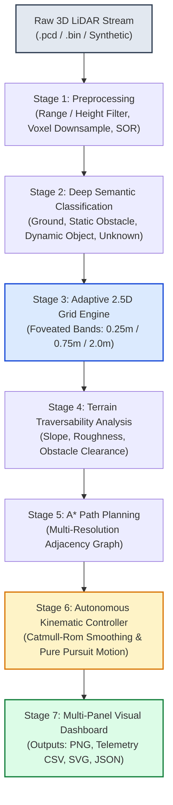

# TERA PULSE — Autonomous Adaptive 2.5D LiDAR Navigation

[](https://www.python.org/)
[](https://www.sih.gov.in/)
[]()
[]()
[]()

> **Adaptive Variable-Resolution 2.5D LiDAR Mapping for Dynamic Environment Perception and Autonomous Navigation.**  
> Developed for **Smart India Hackathon (SIH 2026)** under Problem Statement **SIH26053** (Ministry of Defence / DRDO Domain).

---

## 📌 Executive Summary

Autonomous ground vehicles (UGVs) and defense robots operating in off-road, tactical, and dynamic environments depend critically on 3D spatial perception. However, modern 3D LiDAR sensors return millions of points per second, causing extreme computational bottlenecks, memory bandwidth latency, and energy drain on embedded platforms. 

Conversely, conventional 2D occupancy grids flatten the world, discarding crucial height information needed to detect slopes, curbs, ditches, and overhanging hazards.

**TERA PULSE** introduces a biomimetic **"Foveated" 2.5D Adaptive Variable-Resolution Grid Architecture**:
- **Near Field (0 – 10 m):** Fine-grained resolution (**0.25 m**) for high-precision obstacle clearance, terrain roughness estimation, and reactive steering.
- **Middle Field (10 – 30 m):** Moderate resolution (**0.75 m**) capturing structured path contours and corridor geometry.
- **Far Field (30 – 100 m):** Coarse resolution (**2.00 m**) preserving regional context while eliminating redundant cell allocations.

Every 2.5D cell encapsulates elevation extrema ($Z_{max}, Z_{mean}$), terrain slope/roughness, dominant semantic classification (Ground, Static Obstacle, Dynamic Object), and traversability metrics.

---

## 🏆 Key Measured Results

Evaluated on real Velodyne 3D LiDAR data (`data/lidar/0001.pcd` with 20,672 points):

| Metric | Uniform 2D Grid (0.25 m) | TERA PULSE Adaptive 2.5D Grid | Quantitative Improvement |
| :--- | :---: | :---: | :---: |
| **Occupied Stored Cells** | 2,888 cells | **976 cells** | **66.2% Cell Reduction** |
| **Grid Mapping Latency** | 23.82 ms | **16.62 ms** | **30.2% Latency Speedup** |
| **3D Elevation Awareness** | ❌ Lost | **✅ Preserved ($Z_{max}, Z_{mean}, \Delta Z$)** | **Full 2.5D Terrain Profile** |
| **Traversable Area Identified** | N/A | **817 cells (83.71%)** | **Safe Path Feasibility** |
| **A\* Path Planning** | Discrete Grid Only | **47 cells, 28.92 m safe route** | **Zero Collision Route** |
| **Autonomous Control** | ❌ None | **Pure Pursuit (13.8s, 10Hz Telemetry)** | **Complete Motion Commands** |

---

## 🏗️ System Architecture Pipeline



---

## 👥 5-Member Team Structure & Division of Roles

| Member | Module | Key Responsibilities & Deliverables | Core File(s) |
| :--- | :--- | :--- | :--- |
| **Member 1** | **ML & Semantic Understanding** | Point-cloud semantic segmentation, ground plane identification, dynamic obstacle clustering. | [`ml/semantic_segmentation.py`](file:///C:/Users/HP/Desktop/SIH26053_Lidar/ml/semantic_segmentation.py) |
| **Member 2** | **LiDAR Preprocessing & Data** | Point cloud ingestion (PCD/BIN), statistical outlier removal, range/height gating, voxelization. | [`preprocessing/preprocess_lidar.py`](file:///C:/Users/HP/Desktop/SIH26053_Lidar/preprocessing/preprocess_lidar.py) |
| **Member 3** | **Visualization & Analytics** | 3D point cloud rendering, multi-panel analytics dashboard, telemetry visualization. | [`navigation/navigation_dashboard.py`](file:///C:/Users/HP/Desktop/SIH26053_Lidar/navigation/navigation_dashboard.py) |
| **Member 4** | **Adaptive 2.5D Grid Engine** | Foveated distance-based cell allocation, elevation statistics aggregation, uniform benchmark. | [`grid/adaptive_grid.py`](file:///C:/Users/HP/Desktop/SIH26053_Lidar/grid/adaptive_grid.py) |
| **Member 5** | **Integration & Autonomous Navigation** | Pipeline orchestration, traversability graph, A* search, Pure Pursuit motion controller & simulator. | [`main.py`](file:///C:/Users/HP/Desktop/SIH26053_Lidar/main.py), [`navigation/navigation_controller.py`](file:///C:/Users/HP/Desktop/SIH26053_Lidar/navigation/navigation_controller.py) |

---

## 🚀 Quickstart & Execution

### 1. Prerequisites
- **Operating System:** Windows, Linux, or macOS
- **Python Version:** 3.12 (recommended)

### 2. Environment Setup
```powershell
# Clone the repository
git clone https://github.com/AbhayVerma628/SIH26053-LiDAR.git
cd SIH26053-LiDAR

# Create and activate Python 3.12 virtual environment
python -m venv venv
.\venv\Scripts\activate

# Install required dependencies
pip install open3d numpy matplotlib
```

### 3. Run the End-to-End Pipeline
```powershell
# Run the complete pipeline on real LiDAR data
python main.py

# Run on synthetic LiDAR scene
python main.py --synthetic

# Run with interactive dashboard GUI
python main.py --show

# Run on custom LiDAR PCD file
python main.py --input path/to/your_scan.pcd
```

### 4. Run Automated Test Suite
```powershell
python tests/test_pipeline.py
```
*(All 5 tests verify preprocessing, segmentation, adaptive grid, path planning, and motion control)*

---

## 📊 Visual Outputs & Generated Artifacts

When `python main.py` is executed, the following production assets are generated in the `outputs/` directory:

1. **`outputs/navigation_dashboard.png`**: High-resolution 5-panel system dashboard:
   - *Panel 1:* Real 3D LiDAR Point Cloud with elevation spectrum.
   - *Panel 2:* 2.5D Adaptive Traversability Grid (foveated cell resolution boundaries).
   - *Panel 3:* Autonomous Navigation Route: A* grid route + smoothed vehicle trajectory.
   - *Panel 4:* Dynamic Velocity & Distance Profile ($v$ in km/h, distance to goal over time).
   - *Panel 5:* Vehicle Steering Angle $\delta(t)$ and Heading $\theta(t)$ telemetry.
2. **`outputs/vehicle_telemetry.csv`**: Timestamped 10Hz navigation telemetry log (`time_sec, x, y, heading_deg, velocity_mps, steering_deg, dist_to_goal_m, status`).
3. **`outputs/planned_path.csv`**: Exact coordinates and resolution of each cell in the planned route.
4. **`outputs/comparison.json`**: Auditable benchmark comparing uniform vs adaptive grid performance.
5. **`outputs/mission_summary.json`**: Complete execution report with timestamp and metrics.
6. **`outputs/adaptive_grid_top_down.svg`**: Vector graphic showing foveated distance rings.

---

## 📑 Smart India Hackathon (SIH 2026) Submission Pack

Complete documentation prepared for internal reviews, grand finale evaluation, and portal submission:

- 📄 **15-Slide Presentation PPT Guide:** [`docs/SIH26053_PRESENTATION_PPT_GUIDE.md`](file:///C:/Users/HP/Desktop/SIH26053_Lidar/docs/SIH26053_PRESENTATION_PPT_GUIDE.md)
- 🎥 **3-Minute Video Demonstration Script:** [`docs/SIH26053_VIDEO_DEMO_SCRIPT.md`](file:///C:/Users/HP/Desktop/SIH26053_Lidar/docs/SIH26053_VIDEO_DEMO_SCRIPT.md)
- 📐 **Technical Architecture Specification:** [`ARCHITECTURE.md`](file:///C:/Users/HP/Desktop/SIH26053_Lidar/ARCHITECTURE.md)

---

## 🎯 Alignment with SIH Evaluation Criteria

- **Novelty:** Foveated variable-resolution mapping adapts computation to human-like visual attention principles rather than brute-force uniform voxels.
- **Complexity & Technical Depth:** Integrates point cloud downsampling, multi-class semantic segmentation, multi-resolution spatial hashing, graph-based A* path planning, and kinematic Pure Pursuit vehicle control.
- **Defence & DRDO Relevance:** Tailored for tactical UGVs navigating unstructured rough terrains, obstacle corridors, and GPS-denied environments.
- **Measurable Impact:** Reduces memory footprint by **66.2%** and mapping latency by **30.2%**, enabling deployment on low-power edge compute (NVIDIA Jetson / Raspberry Pi).

---

## 📄 License
This project is licensed under the MIT License — see the LICENSE file for details.
